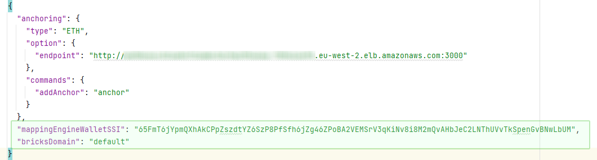

[](https://github.com/PharmaLedger-IMI/epi-workspace/actions/workflows/tests.yml)
[](https://github.com/PharmaLedger-IMI/epi-workspace/actions/workflows/test-build-processes.yml)
# epi-workspace

*epi-workspace*  bundles all the necessary dependencies for building and running EPI SSApps in a single package.

For more details about what a *workspace* is check out the [template-workspace](https://github.com/PrivateSky/template-workspace).

## Table of contents
1. [Installation](#installation)    
   1. [Clone the workspace](#step-1-clone-the-workspace)
   2. [Launch the "server"](#step-2-launch-the-server)
   3. [Build all things needed for the application to run](#step-3-build-all-things-needed-for-the-application-to-run)
2. [Running](#running)
    1. [Demiurge wallet](#demiurge-wallet)
        1. [Admin authorization flow](#admin-authorization-flow)
        2. [Enterprise wallet user authorization flow](#enterprise-wallet-user-authorization-flow)
    3. [Enterprise wallet](#enterprise-wallet)
        1. [Register new account details](#step-1-register-new-account-details) 
        2. [Authorization process](#step-2-authorization-process)
3. [Prepare & release a new stable version of the workspace](#prepare--release-a-new-stable-version-of-the-workspace)        
4. [Build Android APK](#build-android-apk)
5. [Build iOS ipa](#build-ios-ipa)
6. [Configuring ApiHub for Messages Mapping Engine Middleware](#configuring-apihub-for-messages-mapping-engine-middleware)
    1. [Configuring Domain for ApiHub Mapping Engine usage](#configuring-domain-for-apihub-mapping-engine-usage)
    2. [Testing ApiHub Mapping Engine](#testing-apihub-mapping-engine)
7. [ACDC reporting functionality](#acdc-reporting-functionality)
8. [ACF SSApps instalation and test](#acf-ssapps-instalation-and-test)


## Installation

In order to use the workspace, we need to follow a list of steps presented below. 

If you have trouble installing the *epi-workspace*, please try to follow the guide provided on [PrivateSky.xyz](https://privatesky.xyz/?Start/installation)

### Step 1: Clone the workspace

```sh
$ git clone https://github.com/PharmaLedger-IMI/epi-workspace.git
```

After the repository was cloned, you must install all the dependencies.

```sh
$ cd epi-workspace
#Important: If you plan to contribute to the project and/or dependecies please set DEV:true
#in the file env.json before you run the installation!
$ npm install
```
**Note:** this command might take quite some time depending on your internet connection and you machine processing power.

### Step 2: Launch the "server"

While in the *epi-workspace* folder run:

```sh
$ npm run server
```

At the end of this command you get something similar to:


### Step 3: Build all things needed for the application to run.

Open a new console inside *epi-workspace* folder and run:

```sh
# Note: Run this in a new console inside "epi-workspace" folder
$ npm run build-all
```

## Running 
To run the application launch your browser (preferably Chrome) in Incognito mode and access the http://localhost:8080 link.

### Demiurge wallet
Demiurge is intended to be a management platform. Important flows include the user authorization flow for the Enterprise Wallet users.
Once a user create an Enterprise wallet he gets authorized to use the features only after an admin Demiurge user adds the enterprise wallet DID into the ePI write group.

#### Admin authorization flow
The first Demiurge wallet will be the "super admin". This first user will be able to make other users admin by adding them into the ePI admin group.
1. As Demiurge admin open your Demiurge wallet
2. Navigate to the Groups page
3. Select ePI admin group
4. Input the user DID that needs admin priviledges
5. Click add button.

#### Enterprise wallet user authorization flow
1. As Demiurge admin open your Demiurge wallet
2. Navigate to the Groups page
3. Select ePI write group
4. Input the user DID that needs to be authorized to used the Enterprise wallet
5. Click add button.

### Enterprise wallet

Enterprise wallet allows creation of Products and Batches.

#### Step 1: Register new account details

```
Username: test1234

Email: test@test.test

Company: Test Company Inc

Password: Test1234567890#
```


#### Step 2: Authorization process
Once the Enterprise wallet opens will prompt a message to share your DID information with an admin in order get authorized and gain access to the features.


Now you will be able to add Products (and leaflets for it) and create Batches of products and other ePI cool features.


### EPI Client
This is the part a normal user will see. The part that will
be used to scan barcodes on drug's packages.

## Prepare & release a new stable version of the workspace
Steps:
1. start from a fresh install of the workspace.
```
git clone https://github.com/PharmaLedger-IMI/epi-workspace
cd epi-workspace
```
2. ensure that env variable called DEV is set to true in env.json file
>{
>  "PSK_TMP_WORKING_DIR": "tmp",
>  "PSK_CONFIG_LOCATION": "../apihub-root/external-volume/config",
>  **"DEV": true**
>}
3. run the installation process of the workspace
```
npm install
```
4. run the server and build the ssapps and wallets
```
npm run server
npm run build-all
```
4. verify that the builds are successfully and the ssapps are functioning properly
5. execute the freeze command
```
npm run freeze
```
6. verify the output of freeze command and check for errors. If any, correct them and run again the freeze command.
7. commit the new version of the octopus.json file obtained with the freeze command.


### Build Android APK

Steps

1. Install all dependencies for this workspace
```sh
#freeze
npm install

#or development
npm run dev-install
```

2. Bind Android repository into workspace
```sh
npm run install-mobile
```

3. Launch API HUB
```sh
npm run server
```

4. Prepare the Node files that will be packed into the Android app
```sh
#In another tab / console
npm run build-mobile
```

5. Have /mobile/scan-app/android/local.properties file with the following content

```sh
# Change the value to your SDK path
sdk.dir=/home/username/Android/Sdk
```
More on this [here](https://github.com/PrivateSky/android-edge-agent#iv-setup-local-environment-values)

6. Build the APK
```sh
npm run build-android-apk
```

This concludes the steps to build the APK file.

**Note:** The .apk file should be in folder
```
mobile/scan-app/android/app/build/outputs/apk/release
```

### Build iOS ipa
1. Install all dependencies for this workspace (if needed)
```sh
#freeze
npm install

#or development
npm run dev-install
```

2. Bind iOS repository into workspace
```sh
npm run install-mobile
```
If the installation script fails check if you have carthage tool. If you don't have it then install it and rerun the install-mobile step.
```sh
brew install carthage 
``` 

3. Launch API HUB
```sh
npm run server
```

4. Prepare the Node files that will be packed into the iOS app
```sh 
npm run build-mobile
```
5. Go to xCode

Open mobile/scan-app/ios/PSSmartWalletNativeLayer.xcworkspace file with XCode

6. Setup the signing & capabilities
```text
select pskNodeServer from the explorer right pane > into the signing & capabilities tab change the team and bundleID (hint for dev team: if forgot the easy way to find it is in the default bundleId is in firebase/settings ios-epi)
```
7. Ensure that both targets are set for iOS 12
```text
select one by one the psKNodeServer and PSSmartWalletNativeLayer and in general tab check/set version 12 to deployment info section
```
8. Choose target device
```text
before build select the type (phone or any ios) depending on your needs
```
9. Build, Archive and Distribute
```text
Before running the build - archive - distribute process ensure that the certificate that you will use contains necessary device ids. (hint: https://developer.apple.com/documentation/xcode/distributing-your-app-to-registered-devices)
```

## Configuring ApiHub for Messages Mapping Engine Middleware

The purpose of the EPI Mapping Engine is to process various types of messages received from an external source in order to create/update various types of DSUs.

### Configuring Domain for ApiHub Mapping Engine usage

1. Find the domain configuration in ```/apihub-root/external-volume/config/domains/<domainName.json>```
and modify or add the ```bricksDomain``` property with wallet subdomain value.   

3. Restart the server. 
Now the ApiHub Mapping Engine is configured for processing messages from external sources through ```/mappingEngine/:domainName"``` endpoint via the **PUT** HTTP verb.

### Testing ApiHub Mapping Engine
In order to test the mapping engine functionality it can be used any API testing tools.

Make a request like this ``` PUT http://localhost:8080/mappingEngine/<domainName> ```

Set header **token** on the request with the value of the WalletSSI copied from the Holder page after the Issuer-Holder credentials workflow completed.

Please note that the content should be on the request body as a raw string containing the JSON message.
JSON messages examples could be downloaded from the import section page in the wallet app. 

A 200 response status means that the message was successfully sent to the mapping engine, and the processing of the message has started.
This middleware makes use of a message queuing service, which groups and digests messages all at once.
Grouping is important because some messages could depend on other messages (e.g. a batch could not be created until a product is first created and anchored in blockchain), and the service is queuing messages until a previous group is digested.
As a result, a 200 HTTP status code does not imply that the message was successfully digested.
The Import page in the wallet app displays the import's details and status.

A 500 response status means that the domain might not be well configured, or the message is malformed.
The message will not appear in the Import page in the wallet app.

### ACDC reporting functionality

ACDC means Anti-Counterfeiting Data Collaboration - Use-Case 4 of PharmaLedger

1. Bind ACDC repository into workspace
```sh
npm run install-acdc
```

2. Launch ACDC servers
npm run acdc-server


### ACF SSApps instalation and test
For the moment, DelayV and TrueMed Auth SSApps are added into epi-workspace to facilitate the integration of the ACDC workspace and results. In order to accomplish this, special commands where created like npm run install-acf and npm run build-acf-ssapps. 

1. Bind ACDC repository into workspace
```sh
npm run install-acdc
```
2. Install ACF SSApps
```sh
npm run install-acf-ssapps
```
3. Update the apiKeys and secrets in the Auth SSApps

4. Build ACDC Authentication SSApps
```sh
npm run build-acf-ssapps
```
In the console there should be the KeySSI's of the Auth SSApps. We need them in order to properly create and edit batches in order to activate the Authentication feature for them.

Keep in mind that also for testing purpose and fast development the Auth SSApps are also included into the epi mobile build if the npm run install-acf-ssaps was executed.

1. Test ACF Authentication SSApps into mobile build
```sh
npm run build-mobile
```
2. Follow the rest of the standard steps to obtain the mobile build


#BDNS concentions
##Company Sandbox – (Unconnected Blockchain)​

 Domain: sandbox.epi.company​
 Subdomain: sandbox.epi.company​
 Vault: sandbox.vault.company


## Company Dev – (Connected Blockchain)​

 Domain: dev.epi​
 Subdomain: dev.epi.company​
 Vault: dev.vault.company


## Company QA – (Connected Blockchain)​

Domain: qa.epi​
Subdomain: qa.epi.company​
Vault: qa.vault.company


## Company Prod – (Connected Blockchain)​

Domain: epi​
Subdomain: epi.company​
Vault: vault.company


## Developer Sandbox – (No Blockchain)​

Domain: sandbox.epi.company​
Subdomain: sandbox.epi.company​
Vault: sandbox.vault.company


## PLA Demo– (Unconnected Blockchain)​

Domain: demo.epi.pla​
Subdomain: demo.epi.pla​
Vault: demo.vault.pla


## PLA Quality – (cted Blockchain)​

Domain: quality.epi.pla​
Subdomain: quality.epi.pla​
Vault: quality.vault.pla

