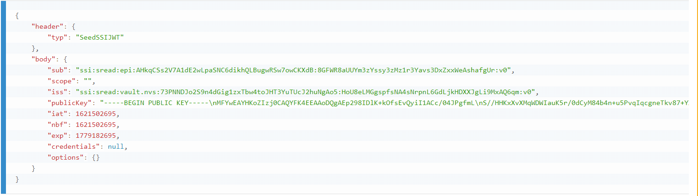

# epi-workspace

*epi-workspace*  bundles all the necessary dependencies for building and running EPI SSApps in a single package.

For more details about what a *workspace* is check out the [template-workspace](https://github.com/PrivateSky/template-workspace).

## Table of contents
1. [Installation](#installation)    
   1. [Clone the workspace](#step-1-clone-the-workspace)
   2. [Launch the "server"](#step-2-launch-the-server)
   3. [Build all things needed for the application to run](#step-3-build-all-things-needed-for-the-application-to-run)
2. [Running](#running)
    1. [Enterprise wallet](#enterprise-wallet)
    2. [Register new account details](#step-1-register-new-account-details) 
    3. [Setup credentials for Issuer and Holder](#step-2-setup-credentials-for-issuer-and-holder)
3. [Prepare & release a new stable version of the workspace](#step-2-setup-credentials-for-issuer-and-holder)        
4. [Build Android APK](#build-android-apk)
5. [Configuring ApiHub for Messages Mapping Engine](#configuring-apihub-for-messages-mapping-engine)
    1. [Configuring Domain for ApiHub Mapping Engine usage](#configuring-domain-for-apihub-mapping-engine-usage)
    2. [Testing ApiHub Mapping Engine](#testing-apihub-mapping-engine)


## Installation

In order to use the workspace, we need to follow a list of steps presented below. 

If you have trouble installing the *epi-workspace*, please try to follow the guide provided on [PrivateSky.xyz](https://privatesky.xyz/?Start/installation)

### Step 1: Clone the workspace

```sh
$ git clone https://github.com/PharmaLedger-IMI/epi-workspace.git
```

After the repository was cloned, you must install all the dependencies.

```sh
$ cd epi-workspace
#Important: If you plan to contribute to the project and/or dependecies please set DEV:true
#in the file env.json before you run the installation!
$ npm install
```
**Note:** this command might take quite some time depending on your internet connection and you machine processing power.

### Step 2: Launch the "server"

While in the *epi-workspace* folder run:

```sh
$ npm run server
```

At the end of this command you get something similar to:


### Step 3: Build all things needed for the application to run.

Open a new console inside *epi-workspace* folder and run:

```sh
# Note: Run this in a new console inside "epi-workspace" folder
$ npm run build-all
```


## Running 
To run the application launch your browser (preferably Chrome) in Incognito mode and access the http://localhost:8080 link.

### Enterprise wallet

Enterprise wallet allows creation of Products and Batches.

#### Step 1: Register new account details

```
Username: test1234

Email: test@test.test

Company: Test Company Inc

Password: Test1234567890#
```

#### Step 2: Setup credentials for Issuer and Holder
    1. Go to MAH as Issuer page
    2. Put "epi" in application domain field and press "Generate an identifier as company" button
    3. Go to User as Holder page
    4. Enter the application domain "epi" and press "Generate an Identifier as User" button
    5. Copy the generated User Identity
    6. Go again to MAH as Issuer page
    7. Paste the generated User Identity into the first input field
    8. Press the "Generate Credential" button
    9. Copy the generated credential
    10. Go again to User as Holder page
    11. In the "Human readable User Identity" section paste the previous generated crendetial and press the button "Save Credential"
    12. Finally for the current user, the Human readable Credential should look like the following: 
    
   
Now you will act as a Holder thus will be able to add Products (and leaflets for it) and create Batches of products.


### EPI Client
This is the part a normal user will see. The part that will
be used to scan barcodes on drug's packages.

## Prepare & release a new stable version of the workspace
Steps:
1. start from a fresh install of the workspace.
```
git clone https://github.com/PharmaLedger-IMI/epi-workspace
cd epi-workspace
```
2. ensure that env variable called DEV is set to true in env.json file
>{
>  "PSK_TMP_WORKING_DIR": "tmp",
>  "PSK_CONFIG_LOCATION": "../apihub-root/external-volume/config",
>  **"DEV": true**
>}
3. run the installation process of the workspace
```
npm install
```
4. run the server and build the ssapps and wallets
```
npm run server
npm run build-all
```
4. verify that the builds are successfully and the ssapps are functioning properly
5. execute the freeze command
```
npm run freeze
```
6. verify the output of freeze command and check for errors. If any, correct them and run again the freeze command.
7. commit the new version of the octopus.json file obtained with the freeze command.


### Build Android APK

Steps

1. Install all dependencies (as develoment) for this workspace
```sh
npm run dev-install
```

2. Bind Android repository into workspace
```sh
npm run install-mobile
```

3. Launch API HUB
```sh
npm run server
```

4. Prepare the Node files that will be packed into the Android app
```sh
#In another tab / console
npm build-mobile
```

5. Have /mobile/scan-app/android/local.properties file with the following content

```sh
# Change the value to your SDK path
sdk.dir=/home/alex/Android/Sdk
```
More on this [here](https://github.com/PrivateSky/android-edge-agent#iv-setup-local-environment-values)

6. Build the APK
```sh
npm build-android-apk
```

This concludes the steps to build the APK file.

**Note:** The .apk file should be in folder
```
mobile/scan-app/android/app/build/outputs/apk/release
```

## Configuring ApiHub for Messages Mapping Engine

The purpose of the EPI Mapping Engine is to process various types of messages received from an external source in order to create/update various types of DSUs.

### Configuring Domain for ApiHub Mapping Engine usage

1. After finishing [Step 2: Setup credentials for Issuer and Holder](#step-2-setup-credentials-for-issuer-and-holder) from [Running section](#running) section please copy
the desired wallet identifier from **User as Holder** page in wallet app.

2. Find the domain configuration in ```/apihub-root/external-volume/config/domains/<domainName.json>```
and ```modify mappingEngineWalletSSI``` property with the wallet identifier and ```bricksDomain``` property with wallet subdomain value.   

3. Restart the server. 
Now the ApiHub Mapping Engine is configured for processing messages from external sources through ```/mappingEngine/:domainName"``` endpoint via the PUT HTTP verb.

### Testing ApiHub Mapping Engine
In order to test the mapping engine functionality it can be used any API testing tools.

Please note that the content should be on the request body as a raw string containing the JSON message.
JSON messages examples could be downloaded from the import section page in the wallet app. 

A 200 response status means that message was successfully sent to the mapping engine, and the processing of message has started.
A 500 response status means that the domain might not be well configured, or the message is malformed.

